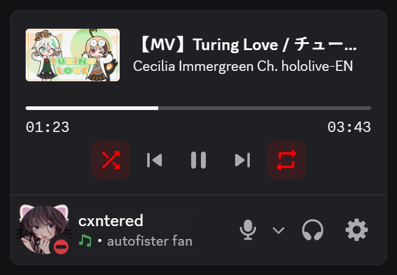

# `YouTubeMusicControls`

A [Vencord](https://vencord.dev) plugin that adds a [YouTube Music](https://music.youtube.com) player above the account panel in Discord.

Based on the [SpotifyControls](https://vencord.dev/plugins/SpotifyControls) plugin built into Vencord. **Requires** the [YouTube Music Desktop App](https://github.com/th-ch/youtube-music) to be running.

## Usage

Firstly, make sure you are using the [YouTube Music Desktop App](https://github.com/th-ch/youtube-music). Enable the `API Server [Beta]` plugin, set the "Authorization strategy" to "No authorization" and keep all other settings as default.

Then, following [this guide](https://docs.vencord.dev/installing/custom-plugins) to setup Vencord for custom plugins, `git clone` this repository into the `src/userplugins` directory of your Vencord installation, run `pnpm build` to build Vencord, inject with `pnpm inject`, and restart Discord.

After that, you can enable the plugin in the Vencord settings under "Plugins" and it should start working, as long as you have the YouTube Music Desktop App running.

## Questions and Answers

### Does this work with `SpotifyControls`?

Not yet. If I'm smart enough, it will be fixed in the future. Currently, if both plugins are enabled, the YouTube Music player will not show up, but the Spotify player will still work.

### Why does the player not show up?

Make sure the `API Server [Beta]` plugin is enabled, and that its using the following settings:

- **Hostname:** `0.0.0.0`
- **Port:** `26538`
- **Authorization strategy:** `No authorization`

If you are using a different port, you can change it in the plugin settings. If it still doesn't work, [make an issue](https://github.com/cxntered/youtubeMusicControls/issues).

### How do I style the player?

The player uses the exact same styles as the `SpotifyControls` plugin, except every instance of `spotify` is renamed to `ytmusic`.

### Why does it make requests every second?

...yeah 😭

Since the YouTube Music Desktop App does not provide a websocket API, the plugin has to poll the API every second to get the current song and player state. This is ~~probably~~ definitely not ideal whatsoever, but unless I'm stupid, it is the only way to reliably get the current state of the player as it could become desynced if the user changes anything in the YouTube Music Desktop App.

## Disclaimer

This is my first Vencord plugin, so it is probably (definitely) not the best code ever. If you have any issues, suggestions or improvements, feel free to [open an issue](https://github.com/cxntered/youtubeMusicControls/issues) or [make a pull request](https://github.com/cxntered/youtubeMusicControls/pulls).

## To Do

- [ ] Add compatibility with `SpotifyControls`
- [ ] Add a setting to change the polling interval
- [ ] Allow using "Authorize at first request" as an authorization strategy
- [ ] Merge pre- and post-visual refresh styles
- [ ] Clean up code
